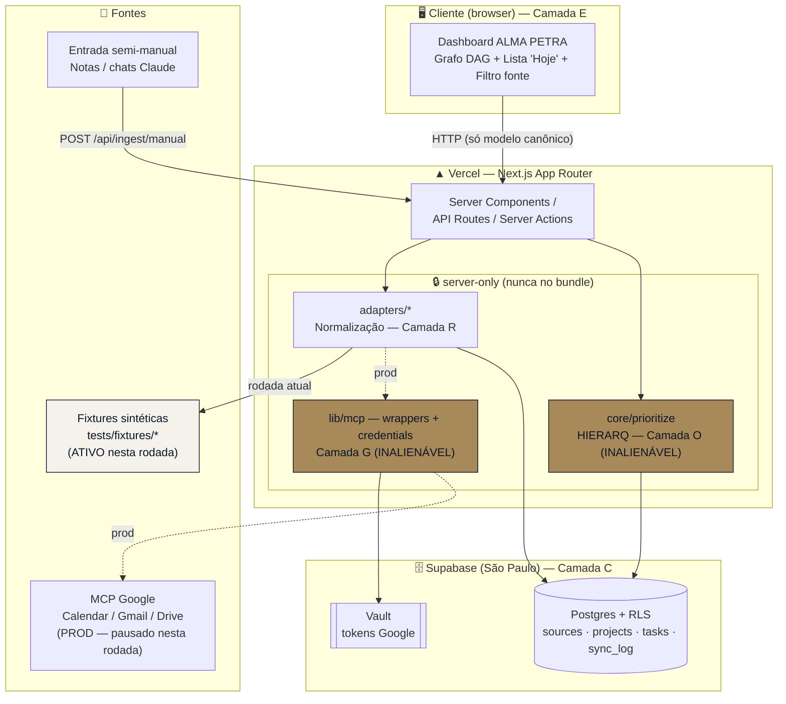

# OS-LIFEBOARD — Fullstack Architecture Document

> Painel único multi-fonte (Google Calendar/Gmail/Drive + entrada manual) com grafo de dependências e motor de priorização diária HIERARQ. Marca **ALMA PETRA** (sistema pessoal de Lucas Scudeler).
>
> **Autor:** Aria (Architect) · **Comando:** `@architect *create-full-stack-architecture` · **Data:** 2026-07-09
> **Fonte da verdade:** `packages/lifeboard/PRD.md` (formato PRD-CANON v1.0) — este documento NÃO reescreve o PRD, apenas o arquiteta.
> **Sequência de execução:** `packages/lifeboard/RUNBOOK.md` (Ordens 0→8, AIOX-PRO v5.0.3).

---

## ⚠️ Nota de execução autônoma (esta rodada — overnight)

> **Referência canônica:** PRD §"Nota de execução autônoma (sessão overnight)".

Nesta rodada, **migration real e credenciais reais estão PAUSADAS** e movidas para revisão manual da manhã. O que está em escopo agora:

| Item | Estado nesta rodada |
|------|---------------------|
| E1→E5 (schema, adapters, entrada manual, motor HIERARQ, dashboard) | **Construir com DADOS SINTÉTICOS DE TESTE** (fixtures) |
| Aplicar migration no Supabase real (`hciiilopyivjaekaxfqp`) | **PAUSADO** — a migration é escrita/versionada mas NÃO é aplicada |
| Conectar OAuth/credenciais Google (Calendar/Gmail/Drive) reais | **PAUSADO** — adapters rodam contra fixtures, não MCPs reais |
| Deploy real (Vercel / n8n) e Fase 2 / E6 | **PAUSADO** — nem começa |

**Consequência arquitetural direta:** o path de dados testado nesta rodada é `Fixture Client → Adapter → Repository (Supabase local/mock) → HIERARQ → Dashboard`. A troca para produção (`MCP Client → Adapter → Supabase real`) deve ser **mecânica** — um flip de configuração, sem reescrever lógica. Isso é o requisito de design nº 1 deste documento (ver §5, Interface de Adapter).

---

## 1. Introdução

Este documento define a arquitetura fullstack completa do OS-LIFEBOARD: backend (Next.js API routes + Supabase), frontend (Next.js App Router + Tailwind), a camada de adapters de ingestão e o motor de priorização HIERARQ. Serve como fonte única de verdade técnica para o desenvolvimento orientado por IA a partir do Runbook.

A premissa estrutural, herdada do PRD §5, é **empacotar, não reinventar**: um modelo canônico único de "tarefa" como coluna vertebral, ingestão via MCPs já conectados (sem OAuth próprio), e dependências declaradas (não inferidas) na v1.0.

### 1.1 Starter Template / Projeto Existente

**Contexto:** este é um app Next.js **novo** dentro do monorepo `aiox-core`, em `packages/lifeboard/`. Não deriva de um starter externo.

- **[AUTO-DECISION]** Usar um starter externo (T3, create-next-app template) → **não** (razão: o monorepo já tem convenções próprias em `.claude/CLAUDE.md`; um starter traria dependências e opinião conflitantes). Estrutura montada à mão seguindo o preset ativo `nextjs-react` (`.aiox-core/data/technical-preferences.md`).
- **Restrição herdada do monorepo:** `aiox-core/CLAUDE.md` governa o *framework* (CLI-first), não apps Next.js. Aplicamos as convenções universais (imports absolutos `@/`, PascalCase para componentes, kebab-case para arquivos, TS sem `any`) e ignoramos as específicas de CLI. O `@/` deste app resolve para `packages/lifeboard/src/` — escopo isolado, sem colisão com o resto do monorepo.

### 1.2 Change Log

| Data | Versão | Descrição | Autor |
|------|--------|-----------|-------|
| 2026-07-09 | 1.0 | Arquitetura fullstack inicial (E1→E5) — rodada autônoma com fixtures; migration/credenciais reais pausadas | Aria (Architect) |

---

## 2. Arquitetura de Alto Nível

### 2.1 Resumo Técnico

O OS-LIFEBOARD é um **app Next.js (App Router) monolítico servido pela Vercel**, com Supabase (Postgres + RLS) como única fonte de estado persistido. O frontend renderiza um dashboard dark ALMA PETRA (grafo de dependências DAG + lista "hoje"). O backend vive em API Routes / Server Actions e nunca expõe fontes cruas nem credenciais ao cliente. A ingestão é feita por **adapters** que consomem MCPs Google (Calendar/Gmail/Drive) — hoje trocados por fixtures — e normalizam tudo para um **modelo canônico único** (`tasks`/`projects`). O motor de priorização **HIERARQ** roda exclusivamente server-side (camada O, inalienável) sobre o modelo canônico, respeitando o grafo de dependências. A arquitetura atinge as metas do PRD (§3) porque o dashboard lê apenas o modelo já normalizado (resposta <5s) e nenhuma fonte precisa ser costurada à mão pelo usuário.

### 2.2 Plataforma e Infraestrutura

**Plataforma:** Vercel (front + API routes) + Supabase (Postgres/RLS/Vault) — decisão fixada no PRD §7/§12, não reaberta.
**Serviços-chave:** Vercel Edge/Serverless Functions · Supabase Postgres · Supabase Auth (single-user) · Supabase Vault (tokens Google, camada G) · MCPs Google (Calendar/Gmail/Drive) via server-side · n8n self-hosted (Fase 2, fora desta rodada).
**Host e Regiões:** Supabase São Paulo (`sa-east-1`, projeto `hciiilopyivjaekaxfqp`); Vercel edge global com functions em `gru1` (São Paulo) quando disponível.

> **[AUTO-DECISION]** Reavaliar Vercel+Supabase vs AWS/GCP → **não reabrir** (razão: PRD §7 já fixou a stack; volume single-user torna qualquer alternativa over-engineering; Artigo IV "No Invention" exige rastrear ao PRD). Trade-off aceito: acoplamento a Vercel/Supabase em troca de zero infra de auth nova.

### 2.3 Estrutura de Repositório

**Estrutura:** app único dentro do monorepo existente, em `packages/lifeboard/`.
**Ferramenta de monorepo:** nenhuma nova — o `aiox-core` já é um monorepo com `packages/*`. O lifeboard é um package auto-contido com seu próprio `package.json`, `tsconfig.json` e alias `@/` local. Sem workspaces compartilhados nesta versão (isolamento máximo = zero acoplamento com o framework AIOX, alinhado ao skill "Architect First").
**Organização de pacotes:** um único package Next.js. Tipos, adapters, core e lib convivem em `src/` com fronteiras internas fortes (ver §3 e §5), não em pacotes npm separados — YAGNI para single-user.

### 2.4 Diagrama de Arquitetura de Alto Nível



### 2.5 Padrões Arquiteturais

- **Jamstack + Serverless:** Next.js App Router na Vercel, estado servido de Postgres. — _Rationale:_ zero infra de servidor persistente; escala trivial para single-user; PRD §9 (cache de leitura, sem fila).
- **Ports & Adapters (Hexagonal) na ingestão:** cada fonte é um adapter atrás de uma *port* (interface `SourceClient`). — _Rationale:_ é o coração da decisão fixture-vs-real (§5); torna a troca mecânica e permite testar normalização sem I/O.
- **Canonical Data Model:** toda fonte heterogênea é normalizada para `tasks`/`projects`. — _Rationale:_ PRD §5(1); o grafo e o HIERARQ só existem porque tudo vira o mesmo formato.
- **Repository Pattern:** acesso a dados encapsulado em `lib/repositories/*`. — _Rationale:_ isola Supabase; adapters e HIERARQ não conhecem SQL; facilita mock em teste.
- **Pure Core / Impure Shell:** HIERARQ e as funções de normalização são **puras** (entrada → saída, sem I/O); I/O (MCP, DB) fica nas bordas. — _Rationale:_ camada O testável e determinística; alinhado ao skill "Architect First" (qualidade garantida por testes).
- **server-only Boundary:** camadas O e G marcadas com `import 'server-only'`. — _Rationale:_ kill-switch nº 3 do PRD (vazamento de `_core-inalienavel` → ABORTA); garante em tempo de build que HIERARQ e credenciais nunca entram no bundle client.

---

## 3. Estrutura de Diretórios (packages/lifeboard/)

```plaintext
packages/lifeboard/
├── PRD.md                          # fonte da verdade (NÃO editar)
├── RUNBOOK.md                      # ordens AIOX-PRO
├── architecture.md                 # este documento
├── package.json
├── next.config.ts
├── tsconfig.json                   # paths: { "@/*": ["./src/*"] }, strict:true
├── tailwind.config.ts              # tokens ALMA PETRA (navy/bone/dourado)
├── vitest.config.ts
├── .env.example                    # NUNCA valores reais (camada G)
│
├── src/
│   ├── app/                        # ── Camada E (UI + API) ──
│   │   ├── layout.tsx              # shell dark ALMA PETRA
│   │   ├── page.tsx                # dashboard (Server Component)
│   │   ├── globals.css
│   │   └── api/
│   │       ├── health/route.ts     # GET /api/health (Supabase + último sync_log.ok)
│   │       ├── today/route.ts      # GET /api/today  → roda HIERARQ (server-only)
│   │       ├── sync/route.ts       # POST /api/sync  → dispara adapters (E2)
│   │       └── ingest/
│   │           └── manual/route.ts # POST /api/ingest/manual → parser E3
│   │
│   ├── components/                 # ── Camada E (UI pura) ──
│   │   ├── dashboard/
│   │   │   ├── today-list.tsx      # lista "hoje" + justificativa por item
│   │   │   ├── source-filter.tsx   # filtro por fonte
│   │   │   └── stale-source-flag.tsx  # flag "fonte X desatualizada" (PRD §9)
│   │   ├── graph/
│   │   │   ├── dependency-graph.tsx # render DAG antecedência→posterioridade
│   │   │   └── task-node.tsx
│   │   └── ui/                      # primitivos (shadcn-style) tematizados
│   │
│   ├── adapters/                   # ── Camada R (normalização) ──
│   │   ├── types.ts                # SourceClient<Raw>, SourceAdapter, DataMode
│   │   ├── factory.ts              # createSourceClient(kind) → fixture | mcp
│   │   ├── calendar/
│   │   │   ├── client.ts           # CalendarClient (port/interface)
│   │   │   ├── client.mcp.ts       # impl REAL — MCP Google_Calendar (server-only)
│   │   │   ├── client.fixture.ts   # impl FIXTURE — lê tests/fixtures/calendar
│   │   │   ├── filter.ts           # regra "nome de Lucas | sigla LS"
│   │   │   └── normalize.ts        # RawCalendarEvent[] → {projects,tasks} (PURA)
│   │   ├── gmail/                  # mesma forma (client.ts/.mcp/.fixture/normalize)
│   │   ├── drive/                  # mesma forma
│   │   └── manual/                 # ── E3: sem client (input é texto colado) ──
│   │       ├── parser.ts           # parse estrutural do texto (zero token)
│   │       └── normalize.ts        # texto → {projects,tasks}; LLM só no resíduo
│   │
│   ├── core/
│   │   └── prioritize/             # ── Camada O — INALIENÁVEL / server-only ──
│   │       ├── server-only.ts      # `import 'server-only'` re-export guard
│   │       ├── hierarq.ts          # S1×S2×S3 + desempate S1>S3>S2 (PURA)
│   │       ├── dag.ts              # resolução de dependências + detecção de ciclo
│   │       └── today.ts            # monta lista "hoje" + justificativa (PURA)
│   │
│   ├── lib/
│   │   ├── supabase/
│   │   │   ├── client.ts           # browser client (anon key) — só leitura via RLS
│   │   │   ├── server.ts           # server client (service role) — server-only
│   │   │   └── middleware.ts       # refresh de sessão
│   │   ├── mcp/                    # ── Camada G-adjacente — server-only ──
│   │   │   ├── credentials.ts      # G: lê env/Vault; NUNCA importado no client
│   │   │   └── google.ts           # wrapper de invocação dos MCPs Google
│   │   └── repositories/           # ── acesso ao modelo canônico ──
│   │       ├── sources.ts
│   │       ├── projects.ts
│   │       ├── tasks.ts
│   │       └── sync-log.ts
│   │
│   ├── types/
│   │   ├── canonical.ts            # Source, Project, Task, SyncLog, HierarqScore
│   │   ├── raw.ts                  # RawCalendarEvent, RawGmailThread, RawDriveFile
│   │   └── database.ts             # tipos gerados do schema Supabase
│   │
│   └── config/
│       └── env.ts                  # acesso validado a env (nunca process.env cru)
│
├── supabase/
│   └── migrations/
│       └── 0001_init.sql           # 4 tabelas + RLS + índices + trigger anti-ciclo DAG
│                                   #   ⚠️ ESCRITA nesta rodada, APLICAÇÃO PAUSADA
│
└── tests/
    ├── fixtures/                   # ── DADOS SINTÉTICOS (ativos nesta rodada) ──
    │   ├── calendar/               # eventos c/ "LS" + agenda de terceiro
    │   ├── gmail/                  # threads marcadas
    │   ├── drive/                  # pastas de projeto
    │   └── manual/                 # blocos de Notas / export de chat
    ├── unit/
    │   ├── hierarq.test.ts         # ordenação + desempate (camada O)
    │   ├── dag.test.ts             # A→B→A rejeitado; ordem topológica
    │   ├── normalize.calendar.test.ts
    │   ├── normalize.gmail.test.ts
    │   ├── normalize.drive.test.ts
    │   └── normalize.manual.test.ts
    └── integration/
        └── sync.test.ts            # fixture → adapter → repo(mock) → HIERARQ
```

**Regra de fronteira (enforced por lint + `server-only`):** `src/components/**` e qualquer `'use client'` **nunca** podem importar de `src/core/prioritize/**`, `src/lib/mcp/**` ou `src/lib/supabase/server.ts`. Essas fronteiras são as camadas O e G do CHC (ver §6).

---

## 4. Tech Stack

> Seleção definitiva. Todo desenvolvimento usa exatamente estas escolhas. Fixado pelo preset ativo `nextjs-react` + PRD §7.

| Categoria | Tecnologia | Versão | Propósito | Rationale |
|-----------|-----------|--------|-----------|-----------|
| Linguagem | TypeScript | 5.x (strict) | Todo o app | `strict`, sem `any`; convenção do monorepo |
| Framework | Next.js (App Router) | 16+ | Front + API routes | PRD §7; SSR + serverless numa base |
| Runtime | Node.js | 20 LTS | Vercel functions | LTS suportado pela Vercel |
| UI Lib | shadcn/ui-style + Radix | atual | Primitivos acessíveis | Preset nextjs-react; tematizável ALMA PETRA |
| Grafo | React Flow | 11+ | Render do DAG de dependências | Node/edge nativo, layout dirigido, pan/zoom |
| Estado (client) | Zustand | 4+ | Filtro de fonte / UI state | Preset ativo; ver gotcha de tipagem em §11 |
| Data fetching | TanStack Query | 5+ | Cache de leitura do dashboard | PRD §9 (cache do dia, sem recomputar) |
| Estilo | Tailwind CSS | 4 | Tokens ALMA PETRA, dark mode | Preset ativo |
| Backend | Next.js Route Handlers / Server Actions | — | API + orquestração de adapters | Sem servidor separado (serverless) |
| API Style | REST (route handlers internos) | — | `/api/today`, `/api/sync`, `/api/ingest/manual`, `/api/health` | Simples, single-user; sem GraphQL |
| Banco | Supabase Postgres | 15 | Estado canônico | PRD §7, projeto São Paulo |
| Segredos | Supabase Vault + env server-side | — | Tokens Google (camada G) | PRD §6/§7: token nunca em tabela cliente |
| Auth | Supabase Auth | atual | `owner = auth.uid()` single-user | PRD §7 (RLS por dono) |
| Ingestão | MCP Google (Calendar/Gmail/Drive) | atual | Fontes API-nativas (PROD) | PRD §5(2): empacotar MCP, sem OAuth próprio |
| Ingestão (rodada) | Fixtures sintéticas | — | Substitui MCP nesta rodada | Nota de execução autônoma |
| Teste | Vitest | 1+/2+ | Unit + integração | Puro/rápido; core determinístico |
| Lint | ESLint (strict-type-checked) | 9 | `no-explicit-any`, `no-floating-promises` | Convenção monorepo |
| Build/Deploy | Vercel | — | Preview + prod + instant rollback | PRD §12 |
| Automação (Fase 2) | n8n self-hosted | — | Cron diário (E6 — fora desta rodada) | PRD §8 |
| Server guard | `server-only` (npm) | atual | Barra O/G do bundle client | Kill-switch nº 3 |

---

## 5. Modelo de Dados e Interface de Adapter (a decisão-chave)

### 5.1 Modelo Canônico (PRD §7 — 4 tabelas)

Espelho TypeScript em `src/types/canonical.ts`. É a coluna vertebral: adapters escrevem aqui, HIERARQ e dashboard leem só daqui.

```typescript
// src/types/canonical.ts
export type SourceKind = 'calendar' | 'gmail' | 'drive' | 'notes' | 'claude_chat';
export type AuthMode = 'api' | 'manual';
export type TaskStatus = 'open' | 'in_progress' | 'blocked' | 'done';

export interface Source {
  id: string;                     // uuid
  kind: SourceKind;
  label: string;
  authMode: AuthMode;
  lastSyncAt: string | null;      // ISO
}

export interface Project {
  id: string;
  sourceId: string;
  externalRef: string;            // id nativo na fonte (idempotência do sync)
  title: string;
  status: string;
  updatedAt: string;
}

export interface HierarqScore { s1: number; s2: number; s3: number; }  // Camada O

export interface Task {
  id: string;
  projectId: string;
  title: string;
  notes: string | null;
  dueDate: string | null;
  status: TaskStatus;
  priorityHierarq: HierarqScore;  // jsonb {s1,s2,s3}
  predecessorIds: string[];       // uuid[]
  successorIds: string[];         // uuid[]
  sourceId: string;
  externalRef: string;
  updatedAt: string;
}

export interface SyncLog {
  id: string;
  sourceId: string;
  runAt: string;
  itemsIngested: number;
  ok: boolean;
  error: string | null;
}
```

**Como cada adapter normaliza para o modelo canônico** (a "Camada R"):

| Fonte | Entrada crua (`types/raw.ts`) | → `projects` | → `tasks` | Regra específica |
|-------|-------------------------------|--------------|-----------|------------------|
| Calendar | `RawCalendarEvent` (agenda, título, descrição, start/end, organizer) | 1 projeto por agenda/label lógico | 1 task por evento; `dueDate = start` | **Filtro** `filter.ts`: aceita só eventos cujo título/descrição contenham o nome de Lucas OU a sigla "LS" — inclusive em agendas de terceiros. `externalRef = eventId`. |
| Gmail | `RawGmailThread` (threadId, subject, labels, snippet) | 1 projeto por label de projeto | 1 task por thread marcada; `dueDate = null` | Só threads com label de projeto. `externalRef = threadId`. |
| Drive | `RawDriveFile` (fileId, name, folder, modifiedTime) | 1 projeto por pasta de projeto | 1 task por doc/subitem relevante | `externalRef = fileId`. `updatedAt = modifiedTime`. |
| Manual (Notas/chats) | `string` (texto colado) | inferido do cabeçalho/título do bloco | 1 task por linha/item estrutural | `parser.ts` estrutural primeiro (zero token); LLM só no resíduo de texto livre, saída por template JSON; **append-only**; se LLM perde tarefa → cai pro parsing bruto (PRD §10 guarda inviolável). |

**Idempotência do sync:** `(sourceId, externalRef)` é a chave lógica de upsert — rodar o sync 2× não duplica. `priorityHierarq`, `predecessorIds`, `successorIds` são **declarados** (Lucas ou curadoria IA opt-in), nunca sobrescritos por um re-sync de fonte (PRD §5(3): dependências declaradas, não inferidas).

### 5.2 Interface de Adapter: real (MCP) vs fixture — **a decisão-chave**

O requisito nº 1 desta rodada (Nota de execução autônoma) é que trocar fixture→real seja **mecânico**. Resolvemos com **Ports & Adapters em duas camadas**:

**Camada 1 — `SourceClient` (a "port" de I/O):** só busca dados crus. Duas implementações intercambiáveis por fonte.

```typescript
// src/adapters/types.ts
export type DataMode = 'fixture' | 'live';

/** Port: busca dados crus de uma fonte. NÃO normaliza. */
export interface SourceClient<Raw> {
  readonly kind: SourceKind;
  readonly mode: DataMode;
  fetchRaw(): Promise<Raw[]>;      // read-only; zero escrita na fonte
}

/** Normalização pura: crua → canônica. Sem I/O, 100% testável. */
export interface SourceAdapter<Raw> {
  readonly kind: SourceKind;
  normalize(raw: Raw[]): { projects: Project[]; tasks: Task[] };
}
```

```typescript
// src/adapters/calendar/client.ts  (port específica)
export type CalendarClient = SourceClient<RawCalendarEvent>;

// src/adapters/calendar/client.mcp.ts  — impl REAL (server-only, PROD)
import 'server-only';
export class McpCalendarClient implements CalendarClient {
  readonly kind = 'calendar'; readonly mode = 'live';
  async fetchRaw(): Promise<RawCalendarEvent[]> {
    // chama o MCP Google_Calendar via lib/mcp/google.ts (usa credenciais da camada G)
    // PAUSADO nesta rodada — não é exercido pelo path de teste
  }
}

// src/adapters/calendar/client.fixture.ts — impl FIXTURE (ATIVA nesta rodada)
export class FixtureCalendarClient implements CalendarClient {
  readonly kind = 'calendar'; readonly mode = 'fixture';
  async fetchRaw(): Promise<RawCalendarEvent[]> {
    // lê tests/fixtures/calendar/*.json (dados sintéticos, inclui evento LS de terceiro)
  }
}
```

**Camada 2 — `factory.ts` (o flip mecânico):** um único ponto decide fixture vs live, lendo config validada.

```typescript
// src/adapters/factory.ts
import { env } from '@/config/env';

export function createCalendarClient(): CalendarClient {
  return env.LIFEBOARD_DATA_MODE === 'live'
    ? new McpCalendarClient()      // produção (após revisão manual)
    : new FixtureCalendarClient(); // rodada atual (default)
}
// idem createGmailClient / createDriveClient
```

**Por que essa forma (trade-offs):**
- A normalização (`normalize.ts`) é **idêntica** para fixture e live — ela recebe `Raw[]` e não sabe de onde veio. Logo os testes de normalização provam a lógica que rodará em produção; a única coisa não-testada com dado real é a *transcrição* MCP→`Raw`, que é um mapeamento fino e isolado em `client.mcp.ts`.
- **Trocar para produção = mudar `LIFEBOARD_DATA_MODE=live` + preencher credenciais** (camada G). Nenhuma linha de lógica de negócio muda. Isso satisfaz literalmente o requisito da Nota de execução autônoma.
- O `FixtureCalendarClient` também é o **mock de teste** — mesma classe serve dev-com-fixture e a suíte Vitest. Zero divergência dev/test.
- Alternativa rejeitada — **[AUTO-DECISION]** injetar o MCP direto no adapter com `if (mock)` espalhado → **rejeitado** (razão: espalha o branch fixture/live pelo código, viola "flip mecânico" e o skill Architect-First zero-coupling; a fábrica centraliza a decisão em 1 arquivo).

**Fluxo de orquestração do sync** (em `/api/sync`, server-only):

```
createXClient() → client.fetchRaw()  →  adapter.normalize(raw)  →  repositories.upsert()  →  sync_log
     (factory)        (I/O: fixture|MCP)     (puro, camada R)          (Supabase)            (auditoria)
```

Degradação graciosa (PRD §9/stress-4): cada fonte sincroniza isolada em `try/catch`; se uma falha, grava `sync_log.ok=false`, mantém o último estado bom das outras e o dashboard mostra a flag "fonte X desatualizada".

---

## 6. Mapeamento CHC (PRD §6) → arquivos concretos

Onde cada camada de blindagem vive fisicamente. As camadas **O** e **G** são `_core-inalienavel` e **nunca** saem do servidor de Lucas (para single-user, "distribuível" = qualquer coisa que chegue ao bundle client ou saia da máquina/servidor).

| Camada CHC | Conteúdo (PRD §6) | Diretórios/arquivos concretos | Enforcement |
|-----------|-------------------|-------------------------------|-------------|
| **E** — licenciável | UI do dashboard, grafo, lista "hoje" | `src/app/**`, `src/components/**` | Pode ir ao client; consome só modelo canônico |
| **C** — histórico | Histórico consolidado de tarefas/projetos | Tabelas `projects`/`tasks` no Supabase; `src/lib/repositories/**` | RLS `owner = auth.uid()` |
| **R** — regras (sênior) | Normalização por fonte (adapters) | `src/adapters/*/normalize.ts`, `src/adapters/*/filter.ts`, `src/adapters/manual/parser.ts` | Roda server-side; puro/testável |
| **O** — **INALIENÁVEL** | Lógica do motor HIERARQ (pesos S1/S2/S3, desempate) | `src/core/prioritize/hierarq.ts`, `dag.ts`, `today.ts` | **`import 'server-only'`** em `core/prioritize/server-only.ts`; lint proíbe import de client; nunca no bundle |
| **G** — **INALIENÁVEL** | Credenciais/tokens Google + conteúdo bruto privado | `src/lib/mcp/credentials.ts`, Supabase Vault, `env` server-side; `src/adapters/*/client.mcp.ts` | Tokens em Vault/env, **jamais** em tabela cliente nem em `.env` versionado; `.env.example` sem valores; `server-only` |

**Verificação (chc-verify / kill-switch nº 3 e 4):** antes de qualquer deploy, um check confirma que `core/prioritize/**`, `lib/mcp/**`, `lib/supabase/server.ts` e qualquer segredo **não aparecem** no bundle client emitido pela Vercel. Se aparecer → **ABORTA**. Nesta rodada, como não há deploy, o gate roda apenas em modo dry-run local sobre o output de `next build`.

**Regra de ouro do server-only boundary:** `core/prioritize/server-only.ts` re-exporta o engine com `import 'server-only'` no topo — qualquer tentativa de importar HIERARQ de um Client Component quebra o build (erro em tempo de compilação), transformando o kill-switch nº 3 em garantia estrutural, não em disciplina manual.

---

## 7. Modelos de API (REST interno)

Todos os handlers são server-side; nenhum expõe fonte crua ou credencial.

| Método | Rota | Camada | Descrição | Resposta |
|--------|------|--------|-----------|----------|
| GET | `/api/health` | infra | Valida conexão Supabase + último `sync_log.ok` | `{ ok, supabase, lastSync }` |
| GET | `/api/today` | **O** | Roda HIERARQ sobre `tasks`; devolve lista "hoje" ordenada + justificativa; omite tarefas com predecessor aberto | `{ items: [{ task, reason }] }` |
| POST | `/api/sync` | R+G | Dispara os adapters (fixture nesta rodada); upsert em `projects`/`tasks`; grava `sync_log` | `{ perSource: [{ kind, ingested, ok }] }` |
| POST | `/api/ingest/manual` | R | Recebe texto colado (Notas/chat); parser → upsert append-only | `{ ingested, tasks }` |

**Contrato de erro unificado** (`src/types/canonical.ts` / handler helper):

```typescript
interface ApiError {
  error: { code: string; message: string; details?: Record<string, unknown>; timestamp: string; };
}
```

> Gotcha aplicado (`.aiox/gotchas.json`): todo `fetch` no client verifica `response.ok` antes de `.json()` — `fetch` não lança em 4xx/5xx.

---

## 8. Motor HIERARQ (Camada O — detalhe)

Fonte da verdade da priorização, PRD §4/§8-E4. **Função pura**, server-only, sem hardcode de dado pessoal.

- **Score:** `S = s1 × s2 × s3` por tarefa (do `priorityHierarq`).
- **Desempate:** `s1 > s3 > s2` (compara s1; empate → s3; empate → s2).
- **Filtro de dependência:** uma tarefa só é "acionável hoje" se **todos** os `predecessorIds` estiverem `done`. Tarefas com predecessor aberto nunca aparecem como acionáveis (respeita o grafo).
- **Justificativa:** cada item da lista "hoje" carrega uma razão curta (ex.: "S alto (125) e sem dependência aberta" ou "desempate por s1").
- **DAG:** `dag.ts` valida ausência de ciclo (ordenação topológica); inserir `A→B→A` é rejeitado tanto no engine quanto no banco (trigger da migration).

**Contrato de teste (camada O, `tests/unit/hierarq.test.ts` + `dag.test.ts`):** dado um grafo sintético, a lista "hoje" bate com o esperado e nenhuma tarefa bloqueada aparece como acionável (PRD Runbook Ordem 4 "PRONTO QUANDO"); ciclo `A→B→A` rejeitado (stress-1).

---

## 9. Schema, Deploy e Segurança (resumo — detalhe é do @data-engineer)

- **Schema DDL detalhado** (4 tabelas + RLS `owner=auth.uid()` + índices `tasks(due_date)`/`tasks(status)` + trigger anti-ciclo DAG): **delegado a `@data-engineer *create-schema`** (Ordem 1). Vive em `supabase/migrations/0001_init.sql`. **Aplicação PAUSADA** nesta rodada (kill-switch nº 1 exige `--confirm-destructive`; e a Nota de execução autônoma proíbe tocar o Supabase real).
- **RLS:** tudo por dono (single-user). Tokens Google **nunca** em tabela — Vault/env (camada G).
- **Deploy:** Vercel (front+API) + Supabase. Health-check `/api/health`. Rollback = Vercel instant rollback; Fase 2 = desligar n8n volta ao estático. **Nada disso executado nesta rodada.**
- **Escala:** single-user, `maxTierTested = 1k tasks`; cache de leitura do dia (não recomputa grafo por request); sem fila.

---

## 10. Estratégia de Testes (a rede de segurança)

Alinhado ao skill "Architect First": qualidade garantida por testes, core puro e determinístico.

```
        E2E (Fase futura)
       /                \
     Integração (sync fixture→adapter→repo mock→HIERARQ)
    /                              \
Unit normalização (R)        Unit HIERARQ/DAG (O)
```

- **Unit (camada O):** `hierarq.test.ts`, `dag.test.ts` — determinismo total, sem I/O.
- **Unit (camada R):** `normalize.{calendar,gmail,drive,manual}.test.ts` — provam a lógica que roda em prod (mesma `normalize` de fixture e live).
- **Integração:** `sync.test.ts` — `FixtureXClient → normalize → repo mock → HIERARQ`, cobrindo os 4 stress tests do PRD §11 (DAG, fluxo até "hoje", degradação de fonte, não-regressão de normalização LLM-vs-bruto diff=0).
- **Fixtures sintéticas** (`tests/fixtures/**`) incluem obrigatoriamente: evento com "LS" em agenda de terceiro, dependência cíclica para o teste de rejeição, e um bloco de Notas com texto livre para o teste LLM-vs-bruto.

---

## 11. Coding Standards (críticos para agentes @dev)

- **Type Sharing:** todo tipo canônico vem de `@/types/canonical`; adapters/HIERARQ/UI importam de lá, nunca redefinem.
- **Imports absolutos:** sempre `@/...` (resolve para `packages/lifeboard/src/`); nunca relativos profundos.
- **Nunca chamar fonte crua no client:** UI fala só com `/api/*`; fontes cruas e credenciais são server-only.
- **server-only guard:** qualquer arquivo em `core/prioritize/**` e `lib/mcp/**` começa com `import 'server-only'`.
- **Env por config:** acesso a segredo só via `@/config/env`, nunca `process.env` cru; `.env.example` sem valores reais.
- **Sem `any`:** tipos próprios ou `unknown` + type guard.
- **Zustand tipado** (gotcha `.aiox/gotchas.json`): `create<StoreType>()(persist(...))` — com parâmetro de tipo e parênteses extras, senão a inferência quebra.
- **fetch defensivo** (gotcha): checar `response.ok` antes de `.json()`.
- **useEffect com cleanup** (gotcha): flag `cancelled` em efeitos async para evitar race no unmount.
- **Convenções de nome:** componentes PascalCase (`TodayList.tsx` → arquivo `today-list.tsx` kebab), hooks `useX`, tabelas snake_case, rotas kebab-case.

| Elemento | Frontend | Backend | Exemplo |
|----------|----------|---------|---------|
| Componentes | PascalCase | — | `TodayList` em `today-list.tsx` |
| Hooks | `useX` | — | `useTodayQuery.ts` |
| Rotas API | — | kebab-case | `/api/ingest/manual` |
| Tabelas | — | snake_case | `sync_log` |

---

## 12. Trade-offs e Riscos (síntese arquitetural)

| Decisão | Ganho | Custo / Risco | Mitigação |
|---------|-------|---------------|-----------|
| Modelo canônico único | Grafo + HIERARQ possíveis; UI simples | Passo de normalização por fonte | Adapters puros e testados (camada R) |
| Ports & Adapters (fixture/live) | Troca prod mecânica; testes provam prod | 1 mapeamento MCP→Raw não coberto por fixture | Isolar em `client.mcp.ts`; teste manual na revisão da manhã |
| Empacotar MCP (sem OAuth próprio) | Zero infra de auth; roda hoje | Acoplamento ao conector | Interface `SourceClient` esconde o MCP atrás da port |
| Dependências declaradas (não inferidas) | Evita inferência mágica frágil | Curadoria manual inicial | Débito nomeado p/ v2 (PRD §5(3)); re-sync não sobrescreve deps |
| server-only para O/G | Kill-switch nº 3 vira garantia de build | — | `import 'server-only'` + chc-verify dry-run |
| App isolado no monorepo (sem workspace compartilhado) | Zero acoplamento com framework AIOX | Alguma duplicação de config | Aceitável para single-user (YAGNI) |

---

## 13. Checklist de Prontidão desta Rodada (E1→E5, fixtures)

- [x] Stack fixada (Next.js App Router + TS strict + Supabase + Tailwind) — §4
- [x] Estrutura de diretórios completa dentro de `packages/lifeboard/` — §3
- [x] Modelo canônico (4 tabelas do PRD §7) + normalização por adapter — §5.1
- [x] Interface adapter real(MCP)-vs-fixture desenhada, flip mecânico via `factory.ts` + `LIFEBOARD_DATA_MODE` — §5.2
- [x] Mapeamento CHC O/G → arquivos concretos com enforcement server-only — §6
- [x] Motor HIERARQ especificado (score, desempate, filtro de dependência) — §8
- [x] Estratégia de testes com fixtures sintéticas cobrindo os 4 stress do PRD §11 — §10
- [x] **Migration real e credenciais reais marcadas como PAUSADAS** — §"Nota de execução autônoma" + §6 + §9
- [ ] Schema DDL detalhado → **delegado a `@data-engineer`** (Ordem 1 do Runbook)
- [ ] Front-end spec ALMA PETRA detalhado → **delegado a `@ux-design-expert`** (Ordem 5 do Runbook)

---

*Arquitetura OS-LIFEBOARD v1.0 — Aria (Architect) — ALMA PETRA — 2026-07-09.*
*Deriva de `packages/lifeboard/PRD.md` (PRD-CANON v1.0). Nenhum requisito inventado (Artigo IV — No Invention): cada seção rastreia a um item do PRD/Runbook.*
*Nesta rodada: E1→E5 com fixtures. Migration no Supabase real e credenciais Google reais PAUSADAS para revisão manual — ver Nota de execução autônoma.*

— Aria, arquitetando o futuro 🏗️
